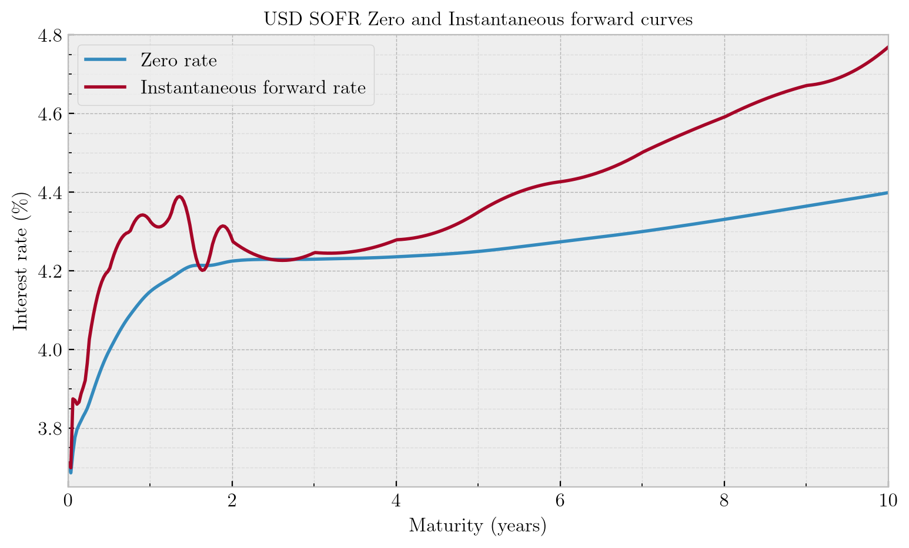
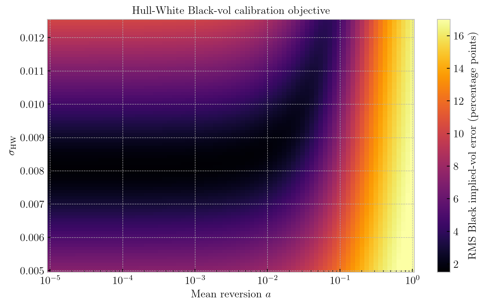
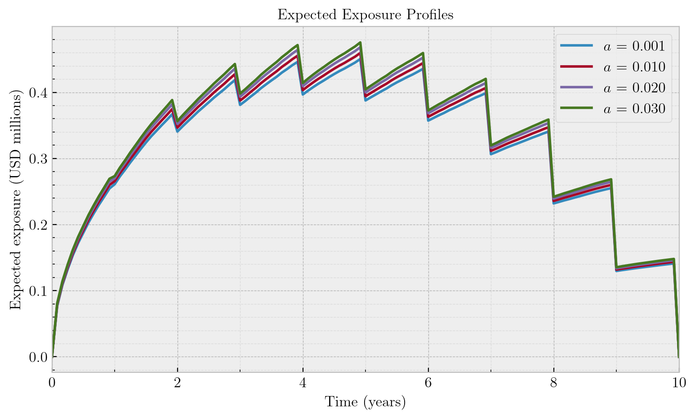

# USD Interest-Rate Counterparty Credit Risk Model Validation

## Overview

This project builds and tests a market-data-driven research framework for interest-rate **counterparty credit risk (CCR)** using USD **Secured Overnight Financing Rate (SOFR) overnight index swaps (OIS)** and publicly reported swaption transactions.

The workflow covers:

- SOFR discount-curve construction;
- transaction-level swaption data cleaning;
- Hull–White one-factor (HW1F) swaption pricing and calibration;
- parameter-identification diagnostics;
- Monte Carlo interest-rate simulation;
- arbitrary-time interest-rate swap revaluation;
- expected exposure (EE), potential future exposure (PFE), and credit valuation adjustment (CVA);
- numerical and model-parameter sensitivity analysis.

The central validation question is:

> **How do selected Hull-White parameter scenarios affect counterparty credit risk when calibration quality also changes?**

The five-instrument public swaption basket produces a relatively flat low-mean-reversion calibration profile. Re-optimising volatility at four selected mean-reversion values produces approximately **5.3%-5.6% differences in peak exposure** and a **4.61% difference in path-discounted CVA** for a representative 10Y par swap. Calibration RMS also worsens by about **48%** between the endpoints. These are selected-scenario sensitivities, not confidence bounds or evidence of equally acceptable market fits.

The focus of the project is the connection between **market-data quality, calibration, parameter identification, numerical validation, and downstream model risk**.

---

## Validation Question

HW1F combines a curve-fitting shift $\varphi(t)$ with a mean-reverting state:

$$
r_t=\varphi(t)+x_t,\qquad
dx_t=-a x_t\,dt+\sigma_{\mathrm{HW}}\,dW_t^{\mathbb Q}.
$$

Calibration estimates mean reversion $a$ and short-rate volatility $\sigma_{\mathrm{HW}}$. For CCR, those parameters also govern the future swap values used to calculate EE, PFE and CVA. The workflow below connects market-data selection, calibration quality, future dynamics and counterparty risk.

A small calibration error is not sufficient evidence that the dynamics relevant for risk are uniquely determined.

---

## Project Workflow

```text
LCH / CFTC SOFR market data
            │
            ▼
      SOFR OIS curve
            │
            ├────────────────────┐
            │                    │
            ▼                    ▼
   CFTC swaption data       Hull–White 1F
            │                    │
            ▼                    ▼
 cleaning / classification   swaption pricer
            │                    │
            └───────────┬────────┘
                        ▼
                    calibration
                        │
                        ▼
              parameter identification
                        │
                        ▼
               Monte Carlo dynamics
                        │
                        ▼
             arbitrary-time swap MtM
                        │
                        ▼
                  EE / PFE / CVA
                        │
                        ▼
              sensitivity / validation
```

The reusable implementation is contained in `src/ccr_validation`, while the notebooks document the market-data choices, methodology, validation checks and results.

---

## Market Data and SOFR Curve

The analysis is frozen to **2 September 2026**.

The USD SOFR OIS curve combines:

- LCH SwapClear standard SOFR OIS rates through 3M;
- same-day Commodity Futures Trading Commission (CFTC) spot-starting SOFR OIS transaction medians from 6M to 2Y;
- LCH standard whole-year maturities from 3Y onward.

The curve is initially bootstrapped and then represented using **piecewise cubic Hermite interpolating polynomial (PCHIP)** interpolation in log-discount-factor space. The discount factors are globally refitted under the final interpolation rule so the selected market instruments are repriced consistently.

The refit optimises positive interval-average forwards, keeping node discount factors positive and decreasing. Notebook 01 contains the curve-pricing expressions and diagnostics.

The final curve passes:

- par-rate repricing checks to numerical precision;
- positive/decreasing discount-factor checks;
- zero-rate and instantaneous-forward diagnostics;
- an independent held-out CFTC 3Y cross-check, approximately **0.4 bp** from the LCH 3Y quote.



---

## CFTC Swaption Data

European USD SOFR OIS swaptions are extracted from transaction-level CFTC Swap Data Repository (SDR) records.

For each observation, the analysis derives:

- option expiry;
- underlying swap tenor;
- payer or receiver direction;
- strike;
- premium per unit notional;
- forward OIS swap rate;
- moneyness;
- Black-76 implied volatility.

A material data-quality issue appears in matching payer/receiver records with identical strikes, maturities and reported premiums. Away from at-the-money (ATM), several such pairs are inconsistent with put-call parity and cannot safely be interpreted as independent option quotes.

The cleaning procedure therefore:

1. removes exact same-side duplicates;
2. identifies matching payer/receiver pairs;
3. collapses near-ATM paired reports whose per-unit economic equivalence was checked during development to a representative observation;
4. excludes ambiguous paired observations away from ATM;
5. restricts the calibration basket to $\mathrm{absolute\ moneyness\ (BP)} \le 5$;
6. retains the closest-to-ATM observation for each expiry/tenor combination.

The final basket contains **five near-ATM instruments**, approximately:

- 1M × 7Y;
- 1M × 10Y;
- 1Y × 30Y;
- 2Y × 20Y;
- 3Y × 10Y.

Economically equivalent paired reports are consolidated into a single representative record, with source identifiers, timestamps and the selection rationale retained for traceability. A separate audit file records reported notionals and premiums per unit notional, with an automated check of premium consistency for near-ATM pairs.

The calibration basket is sparse and covers a single trading day. No calibration acceptance thresholds based on bid–ask spreads or liquidity have been defined. The analysis assumes physically settled European swaptions, with option expiry coinciding with the underlying swap start date. These contract conventions are modelling assumptions; the reported exercise and expiry fields do not confirm them.

---

## Swaption Pricing and Calibration

European swaptions are priced analytically under HW1F using **Jamshidian decomposition**.

The implementation includes:

- Hull–White zero-coupon bond options;
- payer and receiver European swaptions;
- Black-76 swaption pricing;
- Black implied-volatility inversion.

Independent pricing checks include:

- payer/receiver put-call parity to approximately machine precision;
- convergence to forward-swap intrinsic value as $\sigma_{\mathrm{HW}}\rightarrow0$, including an exact $\sigma_{\mathrm{HW}}=0$ regression check.

Calibration was investigated using both relative premium errors and Black implied-volatility errors. Both objectives give the same qualitative result:

> **The model contains a broad low-$\bm{a}$ calibration valley, so the available swaption basket does not identify mean reversion precisely.**

As $a$ increases, the fitted $\sigma_{\mathrm{HW}}$ must also increase to compensate for stronger mean reversion.



The minimum Black-implied-volatility root-mean-square (RMS) error is approximately **1.6 volatility percentage points**.

The downstream study uses the four mean-reversion values in the table below, with $\sigma_{\mathrm{HW}}$ independently re-optimised for each.

These values are **selected profiled parameter scenarios**. They are not statistical confidence bounds or equally acceptable alternative calibrations.

| $a$ | Fitted $\sigma_{\mathrm{HW}}$ | Black-vol RMS (percentage points) | RMS / reference |
|---:|---:|---:|---:|
| 0.001 | 0.008152 | 1.609 | 1.000 |
| 0.010 | 0.008659 | 1.755 | 1.091 |
| 0.020 | 0.009217 | 2.042 | 1.269 |
| 0.030 | 0.009770 | 2.384 | 1.482 |

The endpoint RMS increases by **48.2%**; the sum of squared vol errors increases by **119.7%**. Per-instrument premium and implied-vol residuals are exported to `results/hw_calibration_residuals.csv`. The illustrative RMS multipliers in Notebook 03 have no statistical-confidence or model-acceptance interpretation. The profile alone does not distinguish limited data coverage from constant-volatility HW1F misspecification or other input assumptions.

---

## CCR Framework

The reference trade is a:

- 10Y maturity;
- USD 10 million notional;
- pay-fixed OIS;
- annual fixed payments;
- fixed rate set to the curve-implied par rate.

The initial par rate is approximately **4.48%**, giving an initial mark-to-market (MtM) value numerically close to zero under the implemented contract. This is a stylised annual-accrual swap with year fractions of 1; the market-curve construction uses date-based ACT/360 accruals. Its par rate therefore need not equal the quoted market 10Y OIS rate.

The notional is $\mathcal{N}=10$ million and the fixed coupon is $K=S_{0,n}(0)$. The state uses the exact OU transition, and the swap is revalued between payment dates with realised floating accrual. Notebook 04 validates the simulation; Notebook 05 gives the swap-revaluation expressions.

EE is the mean positive swap value and PFE an upper quantile, both under the risk-neutral measure $\mathbb Q$. $N$ denotes the number of simulation paths.

The baseline simulation uses:

- 50,000 Monte Carlo paths;
- monthly exposure dates;
- weekly simulation, OIS-accrual integration and cumulative path discounting;
- common random numbers across parameter scenarios.

A simplified unilateral CVA calculation uses:

- constant hazard rate: 2%;
- recovery rate: 40%;
- independence between market and credit risk.

CVA uses exposure multiplied by the discount factor from the same path before averaging:

$$
\mathrm{DEE}^{\mathbb Q}(t)=\mathbb E^{\mathbb Q}[D(0,t)V_t^+],
$$

$$
\mathrm{CVA}_0\approx\mathrm{LGD}\sum_{k=1}^{m}
\mathrm{DEE}^{\mathbb Q}(u_k)[Q(u_{k-1})-Q(u_k)].
$$

Here $Q(t)=e^{-\gamma t}$ is survival under $\mathbb Q$, $\mathrm{LGD}=1-\mathrm{REC}$, and $u_k$ are exposure dates. The default weight is the survival decrease over each interval.

Discounting covers the interval from today, $D(0,t)$. Floating accumulation covers the interval since the last payment, $G(T_k,t)$, with $G(s,t)=D(s,t)^{-1}$. Moving the accrual start to each reset does not restart cumulative CVA discounting.

This is a right-endpoint default-time approximation. Trapezoidal rate integration is also approximate even with exact OU transitions; their sensitivities are assessed separately.

---

## Results

### Exposure profiles

The resulting exposure profiles have the expected hump shape: uncertainty initially increases, while remaining maturity and outstanding cashflows decline as the swap approaches maturity.

The sawtooth pattern is generated by annual OIS payment dates, with floating accrual building between payments and resetting after payment.



Along the calibration profile, the increase in fitted $\sigma_{\mathrm{HW}}$ dominates the stronger mean reversion over the 10Y horizon, so EE and PFE increase monotonically with $a$.

Relative to the $a=0.001$ reference:

| $a$ | Peak EE | Peak 95% PFE | Peak 99% PFE | Peak EE change | 95% PFE change | 99% PFE change |
|---:|---:|---:|---:|---:|---:|---:|
| 0.001 | $450.4k | $1.669m | $2.262m | — | — | — |
| 0.010 | $459.6k | $1.702m | $2.306m | +2.04% | +1.96% | +1.92% |
| 0.020 | $468.2k | $1.734m | $2.346m | +3.96% | +3.87% | +3.69% |
| 0.030 | $475.5k | $1.759m | $2.382m | **+5.57%** | **+5.40%** | **+5.29%** |

The effect is systematic across both expected and tail exposure measures, although moderate for this representative trade.

---

### CVA sensitivity

The corrected path-discounted baseline produces:

| $a$ | CVA | Change vs $a=0.001$ |
|---:|---:|---:|
| 0.001 | $27,379 | +0.00% |
| 0.010 | $27,851 | +1.73% |
| 0.020 | $28,287 | +3.32% |
| 0.030 | $28,641 | +4.61% |

Moving between the selected endpoints increases CVA from **$27.38k to $28.64k**, or **4.61%**. The higher-$a$ endpoint also has worse market fit. The measured difference is a sensitivity of this trade under selected HW1F scenarios; it is not an uncertainty bound conditional on an established market-fit acceptance criterion.

---

## Numerical Validation

Numerical and implementation checks are kept separate from the market-calibration analysis.

The validation suite includes:

- exact Hull–White moments versus Monte Carlo estimates;
- exact Ornstein–Uhlenbeck transition versus Euler–Maruyama;
- observed $\mathcal O(\Delta t)$ Euler discretisation bias;
- propagation of discretisation error into EE, PFE and CVA;
- initial par-swap PV checks;
- arbitrary-time swap revaluation and coupon-date reset checks;
- swaption put-call parity;
- swaption zero-volatility limits;
- Monte Carlo seed stability;
- expected path discount factors versus the initial curve;
- discounted reset-date exposure versus analytical swaption values;
- deterministic discounting through multiple coupon dates;
- rate-integration-grid sensitivity;
- common-path exposure/default-time grid sensitivity.

The automated suite contains **27 passing tests**. The stochastic discount-factor and analytical exposure checks use explicit Monte Carlo tolerances (five standard errors plus a small integration allowance). They cover specified cases, not every contract or market regime.

### Monte Carlo robustness

Five paired 50,000-path seeds give an endpoint CVA increase with mean **4.6192%**, sample standard deviation **0.0164 percentage points**, and range **4.5960%-4.6372%**. The selected parameter effect exceeds the observed seed variation in this paired experiment. These five seeds do not measure market-data uncertainty or establish a parameter confidence interval.

### Short-rate integration sensitivity

With monthly exposure dates, refine the simulation grid used for both OIS accrual and discounting:

| Steps per year | CVA, $a=0.001$ | CVA, $a=0.03$ | Relative difference |
|---:|---:|---:|---:|
| 12 | $27,482 | $28,758 | 4.642% |
| 26 | $27,439 | $28,699 | 4.592% |
| 52 | $27,379 | $28,641 | 4.608% |
| 104 | $27,385 | $28,651 | 4.622% |

Each endpoint pair uses common random numbers on its grid. Different grids do not reuse identical Brownian paths, so this checks practical robustness rather than isolating integration bias. Weekly and half-weekly results are close relative to the selected parameter effect; this does not validate the monthly default-time approximation.

### Exposure/default-time grid sensitivity

A separate 10,000-path diagnostic uses one 1/312-year simulation per endpoint and samples its discounted exposures on nested grids. All grids share the same paths within each endpoint, isolating right-endpoint exposure/default-time quadrature from changes in random draws. These absolute CVAs are diagnostic values, not replacements for the 50,000-path baseline.

| Exposure steps per year | CVA, $a=0.001$ | CVA, $a=0.03$ | Relative difference |
|---:|---:|---:|---:|
| 12 | $27,419 | $28,678 | 4.593% |
| 24 | $27,529 | $28,800 | 4.617% |
| 52 | $27,587 | $28,864 | 4.630% |
| 104 | $27,611 | $28,891 | 4.635% |

Monthly to 104 dates per year changes CVA levels by **+0.70%** and **+0.74%**. The parameter ratio changes by **+0.042 percentage points**. Coupon-date jumps and the post-payment convention remain part of this quadrature approximation. Numerical sensitivity should be assessed separately for other trades.

---

## Interpretation and Validation Opinion

The implementation supports a restricted research study of a stylised, uncollateralised single-trade OIS exposure and independent-default unilateral CVA. Analytical identities, numerical convergence and targeted regression tests support the cases assessed.

The sparse basket yields a relatively flat low-$a$ profile, while fit quality materially worsens across the selected scenarios. The observed 4.61% CVA difference and approximately 5% peak-exposure difference are within-model sensitivities for this trade. Neither equally acceptable market fits nor statistical parameter confidence bounds have been established.

The paired-record equivalence checked during development is accepted and source traceability is preserved. Remaining findings are the absence of a bid/ask-based calibration acceptance criterion, uncertain contract conventions in the public reports, stylised accrual/calendar treatment and restricted credit/portfolio scope. These findings prevent a production-use or regulatory-capital validation opinion. The project demonstrates research and validation reasoning; it does not demonstrate bank model approval.

Implementation correctness, market fit and parameter identification are separate assessments. A successful implementation benchmark cannot establish adequate market fit, and a calibration optimum cannot by itself establish uniquely identified risk dynamics.

---

## Limitations

The current study is deliberately narrower than a production CCR framework.

Important limitations include:

- only five usable near-ATM swaptions in the final single-day calibration basket;
- limited option-expiry coverage, weakening identification of long-horizon mean reversion;
- a one-factor Gaussian interest-rate model;
- simplified single-curve SOFR/OIS treatment;
- simplified business-day and payment-lag conventions;
- constant hazard rate and recovery;
- independence between market and credit risk;
- no wrong-way risk;
- no collateral or netting-set modelling;
- parameter uncertainty is studied within HW1F rather than across competing model classes.

The exposure and CVA sensitivities are a **within-model case study** for selected scenarios and one trade. They are not general estimates or approved bounds for interest-rate CCR model risk.

---

## Planned Extensions

The next stage is aimed at distinguishing limitations of the available market data from limitations of the model itself.

Potential extensions include:

1. searching additional CFTC SDR dates for richer option-expiry and underlying-tenor coverage;
2. multi-date HW1F calibration using a common mean-reversion parameter and date-specific volatility;
3. testing alternative SOFR curve-construction methodologies;
4. implementing a two-factor Gaussian challenger model such as G2++;
5. comparing HW1F and G2++ calibration quality, future rate dynamics, EE, PFE and CVA.

This would extend the analysis from **parameter uncertainty within one model** to **structural interest-rate model risk**.

---

## Notebook Guide

| Notebook | Purpose |
|---|---|
| `01_sofr_curve_construction.ipynb.ipynb` | Construct and validate the 2 Sep 2026 USD SOFR OIS discount curve. |
| `02_swaption_data_cleaning.ipynb.ipynb` | Extract, clean and classify CFTC SOFR OIS swaptions and construct the calibration basket. |
| `03_hw1f_calibration_and_identification.ipynb.ipynb` | Calibrate Hull–White 1F and investigate parameter identification. |
| `04_hw1f_numerical_validation.ipynb.ipynb` | Validate the stochastic simulation, pricing and exposure machinery. |
| `05_ccr_parameter_sensitivity.ipynb.ipynb` | Compare selected profiled scenarios, fit residuals, path-discounted CVA and separate numerical sensitivities. |

The README provides the overall model-validation narrative; the notebooks contain the detailed methodology, diagnostics and intermediate results.

---

## Running the Checks

Use Python 3.11 or newer. From the project root, install the project and development dependencies with `python -m pip install -e ".[dev]"`, then run `python -m pytest -q`. Execute notebooks 01 through 05 in order, with each notebook's working directory set to `notebooks/`. Notebook 03 exports the basket read by Notebook 05. Existing plots use LaTeX rendering and require a working TeX installation.

Notebooks 03-05 export their audit and validation tables into `results/`. The existing double `.ipynb.ipynb` filenames are retained.

---

## Repository Structure

```text
.
├── README.md
├── pyproject.toml
├── .gitignore
│
├── data/
│   ├── raw/
│   └── processed/
│
├── notebooks/
│   ├── 01_sofr_curve_construction.ipynb.ipynb
│   ├── 02_swaption_data_cleaning.ipynb.ipynb
│   ├── 03_hw1f_calibration_and_identification.ipynb.ipynb
│   ├── 04_hw1f_numerical_validation.ipynb.ipynb
│   └── 05_ccr_parameter_sensitivity.ipynb.ipynb
│
├── results/
│   ├── figures/
│   └── *.csv / ccr_validation_summary.json
│
├── src/
│   └── ccr_validation/
│       ├── __init__.py
│       ├── calibration.py
│       ├── curves.py
│       ├── cva.py
│       ├── exposure.py
│       ├── hull_white.py
│       ├── swaps.py
│       └── swaptions.py
│
└── tests/
```

---

## Glossary and Abbreviations

| Term | Meaning |
|---|---|
| **USD** | United States dollar. |
| **CCR** | Counterparty Credit Risk — the risk of loss if a derivatives counterparty defaults while the transaction has positive value. |
| **SOFR** | Secured Overnight Financing Rate — a broad measure of the cost of overnight borrowing collateralised by U.S. Treasury securities. |
| **OIS** | Overnight Index Swap — an interest-rate swap whose floating leg is linked to a compounded overnight reference rate. |
| **CFTC** | Commodity Futures Trading Commission — the U.S. derivatives regulator whose public swap-reporting data are used in this project. |
| **SDR** | Swap Data Repository — a repository through which swap transaction data are reported and publicly disseminated. |
| **LCH** | LCH, a major clearing house. LCH SwapClear data are used for part of the SOFR OIS curve. |
| **IRS** | Interest Rate Swap — a derivative exchanging fixed and floating interest-rate cashflows. |
| **HW1F** | Hull–White one-factor model — a Gaussian short-rate model with mean reversion and a deterministic curve-fitting term. |
| **G2++** | A two-factor Gaussian short-rate model with two correlated mean-reverting factors. |
| **PCHIP** | Piecewise Cubic Hermite Interpolating Polynomial — a shape-preserving interpolation method used here in log-discount-factor space. |
| **ATM** | At-the-Money — an option whose strike is close to the corresponding forward market rate. |
| **bp** | Basis point — one hundredth of one percentage point; $1\text{ bp}=0.01\%$. |
| **Black-76** | A standard option-pricing framework used here to convert swaption premiums to implied volatilities. |
| **MtM** | Mark-to-Market — the current value of a trade under prevailing market conditions. |
| **PD** | Probability of Default — the probability that a counterparty defaults over a specified time horizon. |
| **EE** | Expected Exposure — the mean positive future counterparty exposure across simulated scenarios. |
| **DEE** | Discounted Expected Exposure — the risk-neutral mean of exposure multiplied by the discount factor from the same path. |
| **PFE** | Potential Future Exposure — an upper quantile of the future positive-exposure distribution; risk-neutral in this study. |
| **CVA** | Credit Valuation Adjustment — the derivative-value adjustment for expected counterparty default losses. |
| **RMS** | Root Mean Square — used here as a summary calibration-error measure. |
| **OU process** | Ornstein–Uhlenbeck process — the Gaussian mean-reverting process governing the HW1F stochastic state. |
| **Jamshidian decomposition** | A one-factor decomposition of a European swaption into zero-coupon bond options. |
| **Wrong-way risk** | The case where counterparty credit quality deteriorates when exposure to that counterparty increases. |