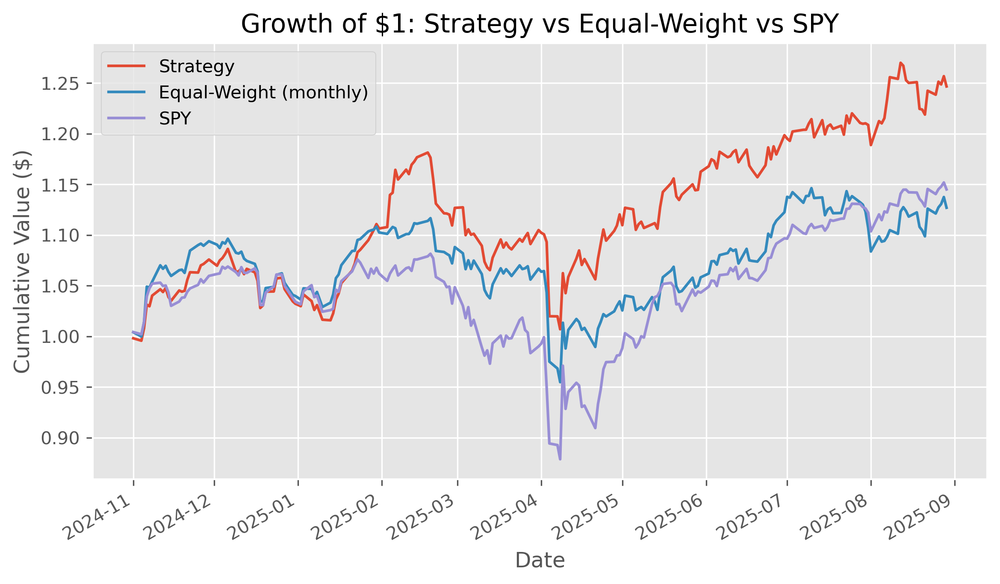

# Momentum-Based Clustering and Portfolio Optimisation

Clustering is widely used in machine learning but less so in portfolio construction. This project tests whether grouping stocks by technical indicators and Fama–French betas yields distinct “momentum regimes” that can be exploited for better Sharpe ratios versus SPY and equal-weight benchmarks.

---

## Methodology

1. **Universe Selection**  
   - S&P 500 constituents  
   - Liquidity filter: top 150 most liquid names  

2. **Feature Engineering**  
   - Technical indicators: ATR, RSI, Bollinger Bands, MACD  
   - Momentum returns (1m, 2m, 3m, 6m, 12m, and 12-1)  
   - Volatility estimators (Rogers–Satchell, Garman–Klass)  
   - Rolling Fama–French five-factor betas  

   Features are calculated daily and resampled to monthly frequency, then normalised using rolling z-scores.

3. **Clustering**  
   - k-means clustering on normalised features  
   - Cluster stability evaluated with silhouette, Calinski–Harabasz, and Davies–Bouldin scores  
   - Momentum (12-1 return) used as the anchor to interpret cluster ordering  

4. **Portfolio Construction**  
   - Long-only tangency (max Sharpe) portfolios using PyPortfolioOpt  
   - Diversification via weight bounds (0–10% per asset)  
   - Monthly rebalancing on the first business day  
   - Risk-free rate estimated from Fama–French monthly series  

5. **Backtesting & Evaluation**  
   - Out-of-sample rolling window evaluation  
   - Performance measured against SPY (S&P 500 ETF)  
   - Risk metrics include Sharpe ratio, drawdowns, and volatility  

---

### Performance vs Benchmark

### Results

| Metric      | Strategy | EW     | SPY    |
|-------------|----------|--------|--------|
| AnnRet      | 0.2860   | 0.1613 | 0.1874 |
| AnnVol      | 0.1796   | 0.1735 | 0.2098 |
| Sharpe      | 1.5927   | 0.9298 | 0.8933 |
| Cumulative  | 0.2467   | 0.1269 | 0.1450 |
| MaxDD       | -0.1476  | -0.1449| -0.1876 |

---

## Tech Stack
- Python (pandas, numpy, matplotlib, scikit-learn, statsmodels)  
- PyPortfolioOpt (portfolio optimisation)  
- yfinance & pandas-datareader (data sources)  
- pandas-ta (technical indicators)  

---

## Key Insights
- Momentum-anchored clustering (k=2) produces distinct asset groups.  
- Tangency portfolios built on “high momentum” clusters exhibit stronger Sharpe ratios than baseline benchmarks, though results are sensitive to rebalancing costs.  
- Survivorship bias in the current S&P 500 list is acknowledged; future work includes point-in-time membership data.