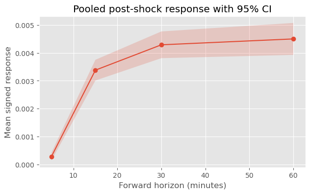

# Intraday Response and Continuation After Large Volatility-Normalised Price Shocks in Liquid ETFs

## Overview

This project studies how liquid ETFs behave after large intraday price shocks using 5-minute data.

The core question is:

> When a liquid ETF experiences a large short-horizon return, normalised by recent realised volatility, does the subsequent return path mean revert, continue, or vary by asset type and time of day?

The project is designed as an event study, thus the goal is to characterise conditional intraday response dynamics in a way that is empirically simple and interpretable.

---

## Research Question and Motivation

Many market narratives suggest that large intraday moves can either:

- **mean revert** as liquidity replenishes and temporary imbalances fade, or
- **continue** as information diffuses and participants adjust more gradually.

This project asks what responses are manifest in liquid ETFs when large shocks (15 minutes return), normalised by recent (approximately 24 hours) realised volatitlity, are seen. 

---

## Data

- **Source:** Stooq intraday ETF files
- **Close:** Split adjusted, but not dividend adjusted
- **Frequency:** 5-minute bars
- **Assets:** 12 liquid ETFs spanning equities, rates, credit, precious metals, energy, and financials

### ETF universe

- **Broad equity:** SPY, QQQ, IWM, DIA  
- **International equity:** EEM  
- **Rates / duration:** TLT, IEF  
- **Credit:** HYG, LQD  
- **Commodities / metals:** GLD  
- **Sectors:** XLE, XLF  

### Timestamp handling

A key data issue was that Stooq timestamps needed to be interpreted as:

- localised to `Europe/Warsaw`
- converted to `America/New_York`
- then made timezone-naive for analysis

This correctly aligned regular trading hours and handled DST transitions.

### Trading hours

Only **regular trading hours** are used:

- first bar: **09:30**
- last bar: **15:55**
- **78 bars per trading day**

Overnight gaps are intentionally excluded from the event study.

---
## Main Events Panel

I built an events panel where each row corresponds to a large 3-bar (15 minutes) return of ETF observation, including:

- `ticker`
- `date_time`, `date`, `time`, `minute_of_day`, `bar_idx`
- `ret_3b`, `vol_78b`
- `ret_fwd_1b`, `ret_fwd_3b`, `ret_fwd_6b`, `ret_fwd_12b`
- `z_shock`, `abs_z_shock`, `shock_sign`, `shock_side`
- `tod_bucket`

This panel forms the basis of the analysis.

---

## Methodology

### 1. Shock event definition

For each ETF-5 minute bar, a same-day $z$-score, $z_{t}^{ ( 3 ) }$, of rolling 3-bar return, $r_{t}^{ ( 3 ) }$, is computed. Here, the standard deviation is the rolling 78-bar (~1 trading day, not necessarily same-day) realised volatility, $\sigma_{t}^{ ( 78 ) }$. Hence, we have

$$z_{t}^{ ( 3 ) } \equiv \frac{ r_{t}^{ ( 3 ) } }{ \sqrt{3}\, \sigma_{t}^{ ( 78 ) } }.$$

Then, a shock event at $t$, is defined by the absolute value of the $z$-score exceeding 2.5, 

$$\text{shock event}_{t} \equiv | z_{t}^{ ( 3 ) } | \ge 2.5.$$

### 2. Forward horizons

Post-shock response within the same day is measured over:

- 1 bar = 5 minutes
- 3 bars = 15 minutes
- 6 bars = 30 minutes
- 12 bars = 60 minutes

---

## Main findings

### 1. Large standardised intraday shocks are followed by continuation, not mean reversion

Using the sign-adjusted response

$$\text{signed forward return} = \text{shock sign} \times \text{forward return},$$

positive values indicate continuation and negative values indicate mean reversion.

Pooled across the 12 ETFs ($N = 345$ events), the average signed response is positive at all horizons:

- **5 min:** +0.000278  
- **15 min:** +0.003380  
- **30 min:** +0.004290  
- **60 min:** +0.004501  

Interpretation: after a large 15-minute volatility-normalised shock, prices tend to continue moving in the **same direction** over the next 15–60 minutes on average.

#### Short Horizon Statistics

|   Horizon |     Mean |   Median |      Std |       SE |   95% CI Low |   95% CI High |
|----------:|---------:|---------:|---------:|---------:|-------------:|--------------:|
|         5 | 0.000278 | 0.000117 | 0.001324 | 0.000071 |     0.000138 |      0.000418 |
|        15 | 0.003380 | 0.002445 | 0.003520 | 0.000190 |     0.003009 |      0.003752 |
|        30 | 0.004290 | 0.003229 | 0.004543 | 0.000245 |     0.003811 |      0.004770 |
|        60 | 0.004501 | 0.003245 | 0.005434 | 0.000293 |     0.003928 |      0.005075 |

### 2. The result is present for both positive and negative shocks

Forward returns by shock side show:

- after **negative shocks**, forward returns remain negative on average,
- after **positive shocks**, forward returns remain positive on average.

The continuation of the negative shocks seem meaningfully larger than the positive shocks. While this is economically plausible, we cannot definitively claim this without a more extensive study.

#### Short Horizon Statsistics by Shock Side

| Shock Side | Minutes | Mean     | Median   | Std      | SE       | 95% CI Low | 95% CI High |
|------------|---------|----------|----------|----------|----------|------------|-------------|
| Negative ($N = 198$) | 5       | 0.000212 | 0.000041 | 0.001351 | 0.000096 | 0.000024   | 0.000400    |
|            | 15      | 0.003376 | 0.002500 | 0.003691 | 0.000262 | 0.002861   | 0.003890    |
|            | 30      | 0.004429 | 0.003250 | 0.005133 | 0.000365 | 0.003714   | 0.005144    |
|            | 60      | 0.005057 | 0.003784 | 0.006143 | 0.000437 | 0.004201   | 0.005912    |
| Positive ($N = 147$) | 5       | 0.000367 | 0.000160 | 0.001287 | 0.000106 | 0.000159   | 0.000575    |
|            | 15      | 0.003387 | 0.002344 | 0.003289 | 0.000271 | 0.002855   | 0.003919    |
|            | 30      | 0.004103 | 0.003054 | 0.003608 | 0.000298 | 0.003520   | 0.004687    |
|            | 60      | 0.003753 | 0.002734 | 0.004204 | 0.000347 | 0.003073   | 0.004433    |

### 3. The effect is broad across the ETF universe

Event counts are reasonably distributed across the expanded universe, with no single ETF fully dominating the sample.

The sign of the response is broadly consistent across:

- equity index ETFs,
- Treasuries,
- credit,
- gold,
- sector ETFs.

Magnitude varies by ETF, but the continuation pattern is not confined to one instrument.

#### Mean Short Horizon Signed Response by Ticker

| Ticker | 5m       | 15m      | 30m      | 60m      | $N$|
|--------|----------|----------|----------|----------|----|
| DIA    | 0.000270 | 0.003557 | 0.004130 | 0.003903 | 30 |
| EEM    | 0.000729 | 0.004459 | 0.006334 | 0.006616 | 23 |
| GLD    | 0.000731 | 0.006759 | 0.009358 | 0.010305 | 32 |
| HYG    | 0.000071 | 0.000885 | 0.001066 | 0.001087 | 28 |
| IEF    | 0.000033 | 0.000921 | 0.001178 | 0.001266 | 29 |
| IWM    | 0.000582 | 0.005198 | 0.006580 | 0.006169 | 35 |
| LQD    | 0.000125 | 0.001130 | 0.001457 | 0.001625 | 31 |
| QQQ    | 0.000352 | 0.004244 | 0.004977 | 0.005690 | 34 |
| SPY    | 0.000213 | 0.003006 | 0.003710 | 0.004224 | 35 |
| TLT    | -0.000026| 0.001822 | 0.002329 | 0.002594 | 26 |
| XLE    | -0.000338| 0.004364 | 0.005193 | 0.004348 | 20 |
| XLF    | 0.000382 | 0.004004 | 0.004917 | 0.005670 | 22 |

### 4. Event timing clusters around plausible information windows

Event times cluster around windows such as:

- ~10:25–11:15
- ~14:35

These line up naturally with the event construction (15-minute shock window) and with common macro-information windows, including policy and news-driven market reactions.

#### Top Ten Event Count by Clock Time

| Clock Time | Count |
|------------|------:|
| 10:35      | 22    |
| 10:40      | 20    |
| 11:05      | 17    |
| 10:25      | 15    |
| 11:10      | 14    |
| 11:15      | 13    |
| 14:35      | 13    |
| 10:45      | 12    |
| 11:20      | 11    |
| 11:00      | 10    |

### 5. Manual event checks support economic plausibility

A small qualitative audit found several large events that line up with recognisable catalysts, including:

- Fed-related announcements,
- macro data surprises,
- yield-driven bond and gold moves,
- risk-on / risk-off equity reactions.

This supports the view that the event filter is capturing real market disturbances rather than arbitrary statistical noise.

#### Event matching

I compiled the top two major shocks (highest $z$-score) found in the data, and note their likely catalyst. 

| ticker | date_time | shock_side | abs_z_shock | likely catalyst | note |
|---|---|---|---:|---|---|
| DIA | 2025-12-10 14:05:00 | positive | 3.792475 | Fed/SEP | post-FOMC pop |
| DIA | 2026-01-21 14:25:00 | positive | 3.655459 | tariff relief | broad risk-on |
| EEM | 2025-12-12 10:25:00 | negative | 4.241262 | AI unwind + yields up | EM risk-off |
| EEM | 2025-11-06 10:35:00 | negative | 4.107784 | AI/risk-off | broad de-risking |
| GLD | 2026-01-16 10:25:00 | negative | 6.808242 | stronger U.S. data / USD | gold hit hard |
| GLD | 2026-02-12 11:10:00 | negative | 5.045494 | strong labor data | fewer cut bets |
| HYG | 2025-10-29 14:35:00 | negative | 4.005106 | hawkish FOMC | spread/rate pressure |
| HYG | 2025-12-10 14:00:00 | positive | 3.602607 | Fed/SEP | initial cut relief |
| IEF | 2026-01-16 10:40:00 | negative | 4.104969 | stronger U.S. data | yields up |
| IEF | 2026-01-09 10:40:00 | positive | 3.555642 | payrolls miss | Treasury bid |
| IWM | 2025-12-10 14:05:00 | positive | 4.850109 | Fed/SEP | strong small-cap reaction |
| IWM | 2025-11-06 10:35:00 | negative | 3.694532 | AI/risk-off | cyclical selloff |
| LQD | 2025-11-28 10:35:00 | negative | 4.174415 | yields up | duration drag |
| LQD | 2025-12-10 14:00:00 | positive | 3.397316 | Fed/SEP | credit relief bid |
| QQQ | 2025-03-05 10:25:00 | negative | 4.201002 | macro growth scare | worth double-checking |
| QQQ | 2025-12-12 11:00:00 | negative | 3.792230 | AI unwind | tech-led selloff |
| SPY | 2025-12-10 14:05:00 | positive | 4.086360 | Fed/SEP | clean event-timestamp match |
| SPY | 2026-01-21 14:25:00 | positive | 3.648831 | tariff relief | sharp reversal higher |
| TLT | 2025-12-10 14:10:00 | negative | 3.927209 | hawkish Fed/SEP | bond selloff |
| TLT | 2026-01-09 10:40:00 | positive | 3.657762 | payrolls miss | long-duration rally |
| XLE | 2025-12-05 11:35:00 | negative | 3.178803 | oil/Fed cross-currents | direction a bit awkward |
| XLE | 2026-03-12 10:50:00 | negative | 3.177918 | oil spike / geopolitics | equity beta dominated |
| XLF | 2025-12-10 14:35:00 | positive | 3.506772 | Fed/curve repricing | banks caught bid |
| XLF | 2026-01-27 10:25:00 | negative | 3.465961 | pre-Fed caution | tentative match |

#### Overlaps
- **2025-12-10 14:00–14:35 — Fed/SEP**
  - Overlap: **SPY, DIA, IWM, TLT, HYG, LQD, XLF**
  - Read: broad macro/policy shock across equities, Treasuries, credit, and financials.

- **2025-11-06 10:35 — AI/risk-off**
  - Overlap: **EEM, IWM**
  - Read: broad de-risking / growth scare.

- **2025-12-12 10:25–11:00 — AI unwind**
  - Overlap: **EEM, QQQ**
  - Read: tech-led selloff spilling into EM/risk assets.

- **2026-01-09 10:40 — payrolls miss**
  - Overlap: **IEF, TLT**
  - Read: Treasury rally, yields lower.

- **2026-01-16 10:25–10:40 — stronger U.S. data**
  - Overlap: **GLD, IEF**
  - Read: stronger dollar / higher yields, gold and bonds pressured.

- **2026-01-21 14:25 — tariff relief**
  - Overlap: **SPY, DIA**
  - Read: broad equity risk-on reversal.

---

## Clean takeaway

The clean takeaway is:

> Large volatility-normalised 15-minute shocks in liquid ETFs are followed, on average, by further same-direction drift over the next 15–60 minutes, not immediate mean reversion. This continuation pattern appears on both the positive and negative sides, is somewhat stronger following negative shocks, and is broadly present across the ETF universe rather than being driven by a single instrument.

The main contribution of the project is to measure the post-shock intraday response cleanly: exact event definition, exact forward horizons, overlap-controlled sampling, and broad cross-asset coverage.

#### Pooled mean post-shock response curve



---

## Limitations

This project is intentionally narrow.

- It does not test a trading strategy.
- It does not model transaction costs or execution.
- It does not claim causal identification for each event.
- It uses a specific event definition (`3-bar shock`, `|z| >= 2.5`, `12-bar cooldown`) rather than a full design sweep.
- Some of the strongest pooled magnitude may be influenced by ETF-specific differences in sensitivity to macro news.

---

## Repository structure

```text
.
├── README.md
├── 01_panel_construction.ipynb
├── 02_events_and_analysis.ipynb
├── data/
│   └── 5 min/
├── outputs/
│   ├── figures/
│   ├── parquets/
└── requirements.txt